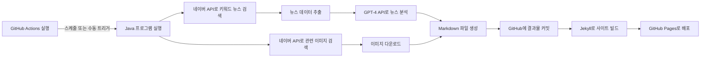

### 📌 **도지코인 트렌드 대시보드**  

이 프로젝트는 **도지코인(Dogecoin) 뉴스 및 트렌드를 분석하고 GitHub Pages로 자동 배포하는 대시보드**입니다.  
매일 최신 뉴스 데이터를 가져와 OpenAI LLM을 활용하여 분석하며, 한국 시간 **오전 8시(KST)** 에 자동 업데이트됩니다.

🔗 **사이트 바로가기:** [GitHub Pages에서 보기](https://nan0silver.github.io/auto_monitoring/)

---

## 🚀 **기능**
✅ 최신 도지코인 뉴스 자동 수집 및 LLM 분석  
✅ 감성 분석 및 미래 트렌드 예측 제공  
✅ **Chart.js**를 이용한 가격 변동 그래프 표시  
✅ **GitHub Actions**를 활용한 자동 업데이트 (매일 오전 8시 KST)  

---

## 📊 **사용 기술**
- **Backend:** Java (HTTP 요청, JSON 파싱)
- **Data Analysis:** OpenAI LLM (gpt-4)
- **Visualization:** Chart.js
- **Deployment:** GitHub Pages, GitHub Actions  

---
